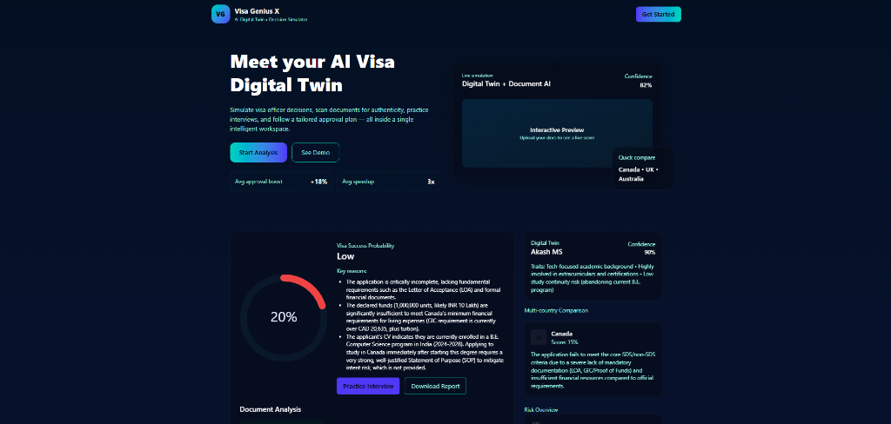

# Visa Genius X 🌍✈️

**Visa Genius X** is an AI-powered Visa Application Assistant that simplifies the daunting task of visa documentation and eligibility assessment. By leveraging advanced computer vision and Large Language Models (Google Gemini), it analyzes user profiles and uploaded documents (like passports and financial records) to provide a "Visa Success Probability" score, identify risks, and offer actionable insights.


*(Replace with actual screenshot link)*

## 🚀 Features

-   **AI Document Analysis**: Automatically detects and validates uploaded documents (Passport, Bank Statements, Offer Letters).
-   **Success Probability Score**: Uses AI to calculate a 0-100% chance of visa approval based on the target country's requirements.
-   **Risk Assessment**: Highlights specific red flags (e.g., "Low Funds", "Inconsistent Travel History").
-   **Multi-Country Comparison**: Compares eligibility across popular destinations (Canada, UK, Australia, etc.).
-   **Modern UI/UX**: Built with React and Tailwind CSS for a seamless and responsive experience.

## 🛠️ Tech Stack

-   **Frontend**: React (Vite), Tailwind CSS v4, Framer Motion
-   **Backend**: Node.js, Express.js
-   **AI/ML**: Google Gemini API (`gemini-flash-latest`), Generative Language API
-   **Deployment**: LocalHost (ready for Vercel/Render)

## 📦 Installation & Setup

### Prerequisites
-   Node.js installed (v16+)
-   Google Gemini API Key ([Get one here](https://aistudio.google.com/app/apikey))

### 1. Clone the Repository
```bash
git clone https://github.com/Akash8275-ms/Visa-Genius-X.git
cd Visa-Genius-X
```

### 2. Backend Setup
1.  Navigate to the project root.
2.  Install dependencies:
    ```bash
    npm install
    ```
3.  Create a `.env` file in the root directory:
    ```bash
    cp .env.example .env
    ```
4.  Add your API Key to `.env`:
    ```env
    GEMINI_API_KEY=AIzaSy...YourKeyHere...
    ```
5.  Start the backend server:
    ```bash
    npm run server
    ```
    *Server will start on `http://localhost:3000`*

### 3. Frontend Setup
1.  Open a new terminal.
2.  Start the frontend:
    ```bash
    npm run dev
    ```
3.  Open `http://localhost:5173` in your browser.

## 💡 How It Works

1.  **Enter Profile**: Fill in basic details (Age, Education, Destination, Funds).
2.  **Upload Docs**: Drag & drop your Passport, Proof of Funds, etc.
3.  **Analyze**: The backend sends the text summary and image data to Gemini 1.5 Flash.
4.  **Results**: The AI acts as a "Virtual Visa Officer" and returns a detailed JSON analysis, which is rendered as charts and scores on the dashboard.

## 🛡️ Privacy
-   Documents are processed in-memory and sent directly to the AI for analysis. They are **not stored** permanently on the server.

---
*Built for Hackathon 2025*
